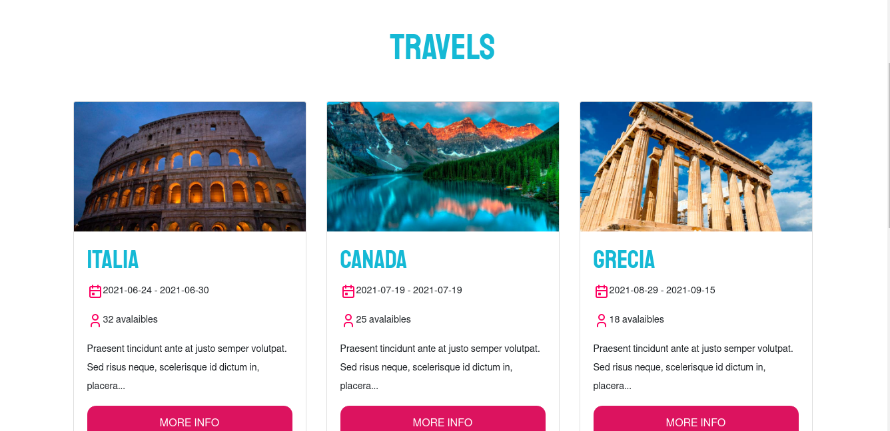
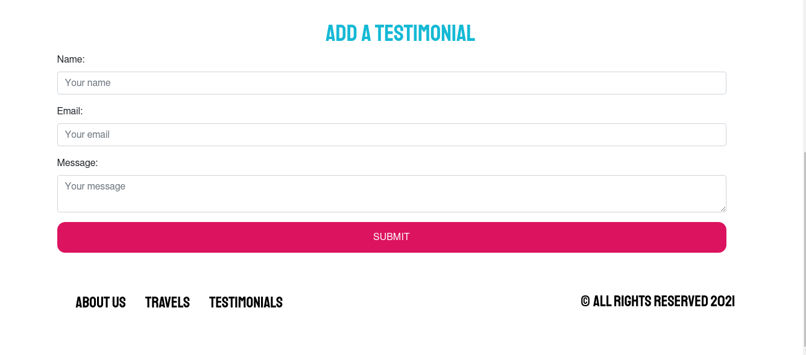

# Travel Agency

Travel agency is a website whose purpose is to display information about an imaginary company that is stored in databases.

You can see the project working on it by [clicking here](https://travel-agency-cesaralvarod.herokuapp.com/testimonials)


Data brought from a database:





# Content

- [Clone](#clone)
- [Starting](#starting)
- [Deploy](#deploy)
- [Copyright](#copyright)

# Clone

To install the project you have to clone the repository:

```
git clone https://github.com/cesaralvarod/travel-agency-node
```

Now go to the project folder

```
cd travel-agency-node/
```

# Starting

## Pre-requeriments

- MySQL

  You must have MySQL installed and insert the SQL code of [travelagency.sql](./travelagency.sql)

- NodeJS

  You must have NodeJS installed to be able to run npm commands

## Installation

To install the dependencies of Travel Agency you need to run:

```
npm install
```

## Running

Once the project dependencies are installed, you are ready to run. We will use the following command:

```
npm start
```

If you want to run the project in developer mode, you can use the following command:

```
npm run dev
```

In both cases the project will run on **localhost:4000**

# Deploy

To deploy the project you will execute the following command:

```
npm run build
```

# Copyright

This project is part of the course "Javascript Modermo" by [**Juan de la Torre**](https://codigoconjuan.com/)
